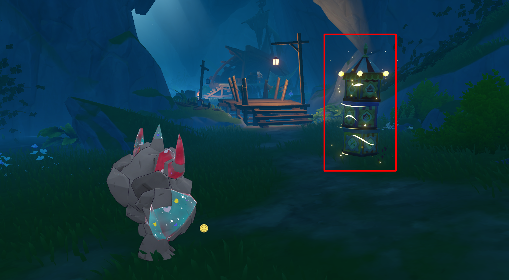

# Roco Lucky Box Detector

Fork from [MeiPixel/RocoGiftyBoxDetector](https://github.com/MeiPixel/RocoGiftyBoxDetector)

洛克王国世界S2赛季，【幸运惊喜盒】检测器。

防止错过【幸运惊喜盒】的打开瞬间，自动录制 GIF，帮助你回顾盒子的三项属性（精灵类型、血脉、性格）。

匹配率 99.99%。

## 使用

### 可执行文件

1. 下载 [Releases](https://github.com/Lu-Jiejie/RocoLuckyBoxDetector/releases) 中的最新版本
2. 新建一个文件夹，将 `lucky_box_detector.exe` 放入其中，以防配置文件混乱。
3. 双击 `lucky_box_detector.exe` 启动程序，默认会在同目录下创建 `config`、`captures`、`verify` 文件夹。
4. 在程序中框选名字和盒子区域，并确保开始检测后，就可以开始清理奇遇事件了。

### 源码方式

```bash
pip install -r requirements.txt

# 启动 GUI
python lucky_box_detector.py

# 指定模板和匹配阈值
python lucky_box_detector.py --template name.png --threshold 0.70
```

### 框选范围参考

名字框选范围：


盒子框选范围：


## 原理

当用户清理奇遇事件的【幸运惊喜盒】时，程序会检测名字区域的变化，一旦由“幸运惊喜盒”变为消失，说明盒子被打开了，此时程序会自动录制一个短 GIF，捕捉盒子打开的瞬间，帮助用户回顾盒子的属性。

## 关键目录

```
项目根目录/
├── captures/              # GIF 录制输出
├── config/                # lucky_box_config.json (ROI + 参数持久化)
└── verify/                # 框选验证截图
```

## 打包

```bash
pip install pyinstaller
pyinstaller lucky_box_detector.spec
```
